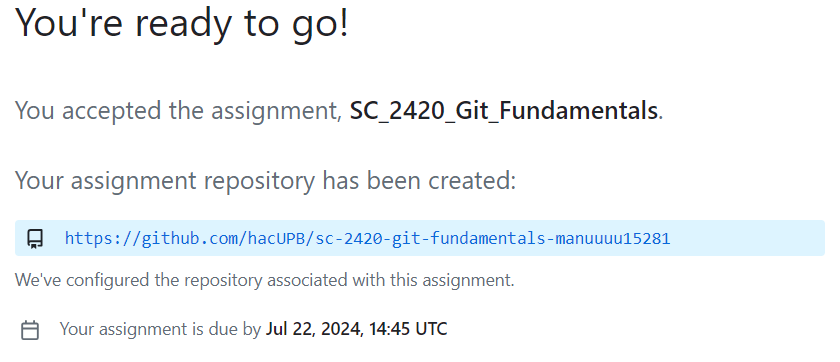

## Documentación del proyecto
# Descripción del proyecto
En este proyecto se busca reforzar los conceptos vistos en la primera semana de clase, buscamos recordar como manejar el repositorio local y remoto, para que sirven y como aportan a la manipulación del codigo. Tambien se busca recordar los comandos basicos usados en GitBash y la utilidad de cada uno. Por ultimo se introduce a la clonación de repositorios y por medio de una actividad guiada se espera que el concepto quede claro con la practica propuesta por el docente.  

# Clonar un repositorio y su correcta configuración
Pasos para clonar un repositorio
- Entrar al link del repositorio que se desea clonar

- Clic a "code" y copiar el link que aparece a continuación

- abrir el GitBash y verificar no estar dentro de otro repositorio
- Usar el comando 'git clone + link ' para clonar el repositorio

- Usar el comando 'ls' para verificar si el repositorio se clonó exitosamente

- Usar el comando 'cd + nombre del repositorio' para entrar a navegar en el

